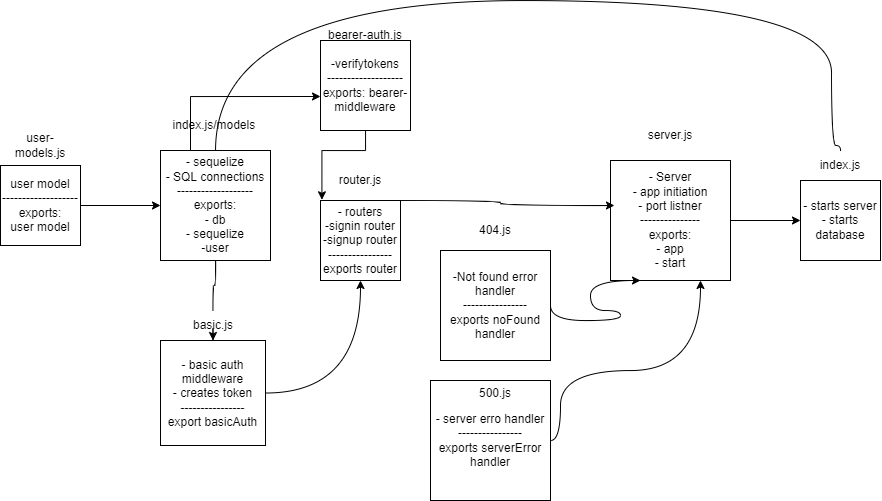

# bearer-auth
## UML

## [pull-request](https://github.com/Mhsalameh/bearer-auth/pull/7)
## [actions](https://github.com/Mhsalameh/bearer-auth/actions)
## [heroku app](https://mohammad-bearer-auth.herokuapp.com/)
